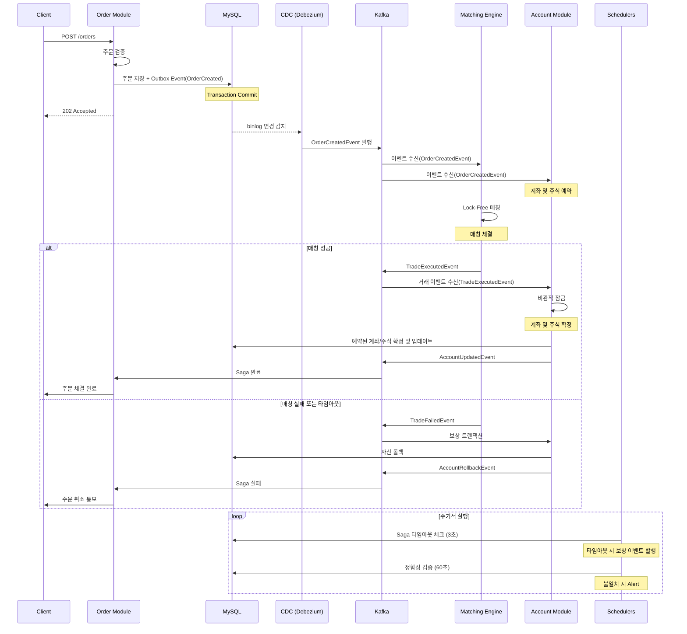

## 📌 프로젝트 개요

- 증권사에서 분산환경을 적용한다면 어떻게 할지 궁금해서 만들어본 프로젝트
- 분산환경에서 대규모 트래픽과 데이터 정합성을 어떻게 지킬 수 있을지 고민하며 서버만 구현
- 실제 증권사 시스템의 핵심인 주문-체결-정산 프로세스를 최대한 단순하게 구현

## ⏳ 가정 및 제약사항

### 의도적 단순화
- 데이터베이스는 1개로 통합
- 사용자 인증/인가 제외 (user id 만으로 처리)
- 실제 시세 연동 대신 가상 시세 생성기 사용
- 주문 유형은 시장가/지정가만 지원 (정정/취소 제외)

### 집중한 부분
**동시성 제어**
- 수천 건의 동시 주문을 처리 (Kafka 파티셔닝 + Lock-Free 매칭 엔진)
- 서버가 여러 대일 때 계좌 동시 접근 제어 (DB 비관적 락)

**데이터 정합성**
- 체결 실패 시 일관성 있는 롤백 (Saga 패턴의 보상 트랜잭션)
- 장애 발생 시에도 데이터 무결성 보장 (Reconciliation 스케줄러로 주기적 검증)

**이벤트 신뢰성**
- 이벤트 유실 방지 (Outbox 패턴 + CDC로 At-least-once 보장)
- 중복 처리 방지 (멱등성 키 + Exactly-once 시맨틱)
- 이벤트 순서 보장 (심볼별 동일 파티션 라우팅)

**분산 트랜잭션**
- Kafka와 DB 간 트랜잭션 일관성 (Transactional Outbox + 스케줄러)
- 타임아웃 감지 및 자동 복구 (Saga Timeout 스케줄러)

### 검증 목표
- **성능**: 단일 인스턴스 1,000 TPS, 체결 레이턴시 100ms 이내
- **정합성**: 모든 거래 후 계좌 잔고와 주문 내역 일치
- **안정성**: 네트워크 장애, 서버 다운 시에도 데이터 무결성 유지

## 🏗️ 기술 스택
- **Language**: Kotlin, Java 17
- **Framework**: Spring Boot 3.2, Spring JPA
- **Message Queue**: Apache Kafka (Event-Driven Architecture)
- **Database**: MySQL
- **CDC**: Debezium (Transactional Outbox Pattern)

## ⚙️ 시스템 아키텍처 및 플로우

